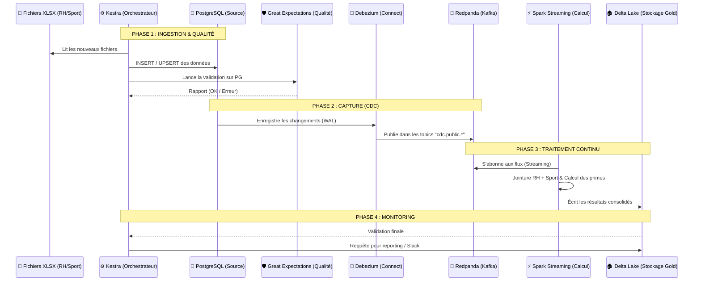

```mermaid
sequenceDiagram
    participant XLSX as 📁 Fichiers XLSX (RH/Sport)
    participant Kestra as ⚙️ Kestra (Orchestrateur)
    participant PG as 🐘 PostgreSQL (Source)
    participant GE as 🛡️ Great Expectations (Qualité)
    participant DBZ as 🐝 Debezium (Connect)
    participant RP as 🔴 Redpanda (Kafka)
    participant Spark as ⚡ Spark Streaming (Calcul)
    participant Delta as 🏠 Delta Lake (Stockage Gold)

    Note over Kestra, PG: PHASE 1 : INGESTION & QUALITÉ
    Kestra->>XLSX: Lit les nouveaux fichiers
    Kestra->>PG: INSERT / UPSERT des données
    Kestra->>GE: Lance la validation sur PG
    GE-->>Kestra: Rapport (OK / Erreur)
    
    Note over PG, RP: PHASE 2 : CAPTURE (CDC)
    PG->>DBZ: Enregistre les changements (WAL)
    DBZ->>RP: Publie dans les topics "cdc.public.*"

    Note over RP, Delta: PHASE 3 : TRAITEMENT CONTINU
    Spark->>RP: S'abonne aux flux (Streaming)
    Spark->>Spark: Jointure RH + Sport & Calcul des primes
    Spark->>Delta: Écrit les résultats consolidés
    
    Note over Delta, Kestra: PHASE 4 : MONITORING
    Delta-->>Kestra: Validation finale
    Kestra->>Delta: Requête pour reporting / Slack
```
