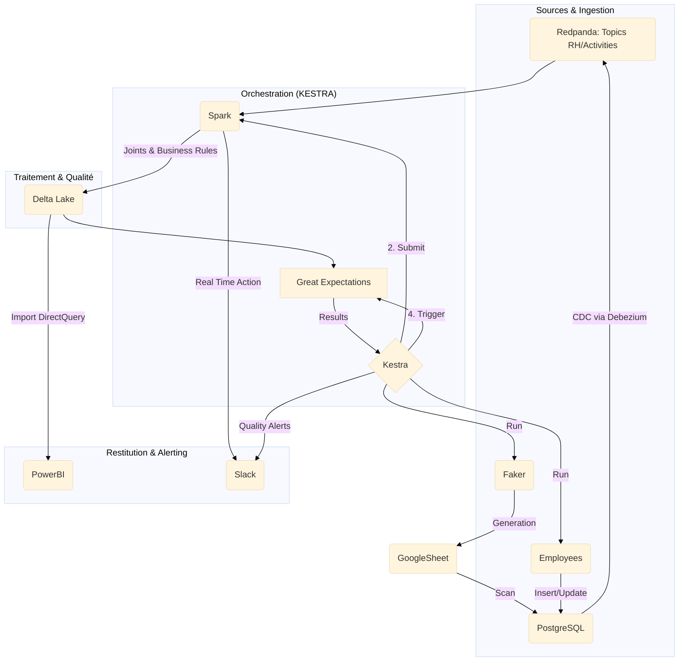

```mermaid
---
config:
  theme: base
  layout: dagre
---
flowchart TB
 subgraph subGraph0["Sources & Ingestion"]
        RP("Redpanda: Topics RH/Activities")
        PG("PostgreSQL")
        FK("Faker")
        RH("Employees")
  end
 subgraph subGraph1["Orchestration (KESTRA)"]
        KE{"Kestra"}
        SP("Spark")
        GE["Great Expectations"]
  end
 subgraph subGraph2["Traitement & Qualité"]
        DL("Delta Lake")
  end
 subgraph subGraph3["Restitution & Alerting"]
        BI("PowerBI")
        SL("Slack")
  end
    PG -- CDC via Debezium --> RP
    FK -- Generation --> GS(GoogleSheet)
    GS --Scan--> PG
    RH -- Insert/Update --> PG
    KE -- Run --> FK & RH   
    KE -- "2. Submit" --> SP
    KE -- "4. Trigger" --> GE
    RP --> SP
    SP -- Joints & Business Rules --> DL
    DL --> GE
    DL -- Import DirectQuery --> BI
    SP -- Real Time Action --> SL
    GE -- Results --> KE
    KE -- Quality Alerts --> SL
```